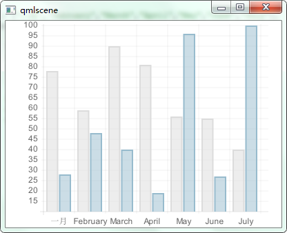
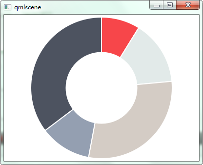
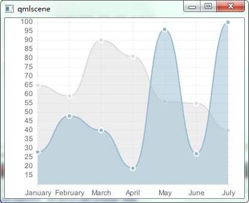
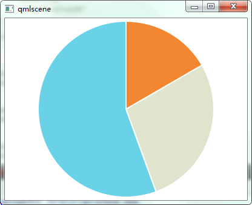
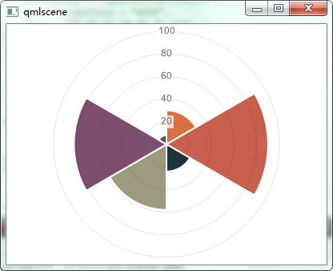
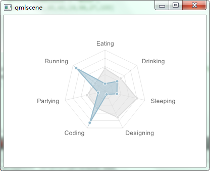

# Chart.qml

```
// draw a bar
object bar(data,option)

// draw a doughnut
object doughnut(data,option)

// draw a line
object line(data,option)

// draw a pie
object pie(data,option)

// draw a polarArea
object polarArea(data,option)

// draw a radar
object radar(data,option)

```

## bar



```
bar({
    labels : ["一月","February","March","April","May","June","July"],
    datasets : [
        {
            fillColor : "rgba(220,220,220,0.5)",
            strokeColor : "rgba(220,220,220,1)",
            data : [test,59,90,81,56,55,40]
        },
        {
            fillColor : "rgba(151,187,205,0.5)",
            strokeColor : "rgba(151,187,205,1)",
            data : [28,48,40,19,96,27,100]
        }
    ]
    });
```

## doughnut



```
doughnut([
             {
                 value: 30,
                 color:"#F7464A"
             },
             {
                 value : 50,
                 color : "#E2EAE9"
             },
             {
                 value : 100,
                 color : "#D4CCC5"
             },
             {
                 value : 40,
                 color : "#949FB1"
             },
             {
                 value : 120,
                 color : "#4D5360"
             }

         ]);
```

## line



```
line({
         labels : ["January","February","March","April","May","June","July"],
         datasets : [
             {
                 fillColor : "rgba(220,220,220,0.5)",
                 strokeColor : "rgba(220,220,220,1)",
                 pointColor : "rgba(220,220,220,1)",
                 pointStrokeColor : "#fff",
                 data : [65,59,90,81,56,55,40]
             },
             {
                 fillColor : "rgba(151,187,205,0.5)",
                 strokeColor : "rgba(151,187,205,1)",
                 pointColor : "rgba(151,187,205,1)",
                 pointStrokeColor : "#fff",
                 data : [28,48,40,19,96,27,100]
             }
         ]
     });
```

## pie



```
pie([
        {
            value: 30,
            color:"#F38630"
        },
        {
            value : 50,
            color : "#E0E4CC"
        },
        {
            value : 100,
            color : "#69D2E7"
        }
    ]);
```

## polarArea



```
polarArea([
              {
                  value : 30,
                  color: "#D97041"
              },
              {
                  value : 90,
                  color: "#C7604C"
              },
              {
                  value : 24,
                  color: "#21323D"
              },
              {
                  value : 58,
                  color: "#9D9B7F"
              },
              {
                  value : 82,
                  color: "#7D4F6D"
              },
              {
                  value : 8,
                  color: "#584A5E"
              }
          ]);
```

## radar



```
radar( {
          labels : ["Eating","Drinking","Sleeping","Designing","Coding","Partying","Running"],
          datasets : [
              {
                  fillColor : "rgba(220,220,220,0.5)",
                  strokeColor : "rgba(220,220,220,1)",
                  pointColor : "rgba(220,220,220,1)",
                  pointStrokeColor : "#fff",
                  data : [65,59,90,81,56,55,40]
              },
              {
                  fillColor : "rgba(151,187,205,0.5)",
                  strokeColor : "rgba(151,187,205,1)",
                  pointColor : "rgba(151,187,205,1)",
                  pointStrokeColor : "#fff",
                  data : [28,48,40,19,96,27,100]
              }
          ]
      });
```
